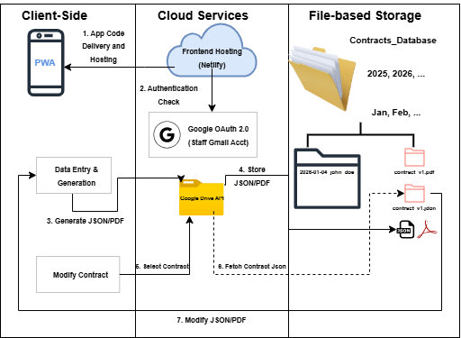

### System Architecture Diagram

This diagram shows the interaction between the client-side application and the two cloud services (Netlify and Google Drive). Netlify hosts the frontend while Google Drive serves as the storage system for the contracts. In the application, there are mainly two functions: **Data Entry and Generation**, **Modify Contract**. Each function communicates with the **Google Drive API** to either store or fetch relevant files.

For more details:

*Getting into the Application*
1. **Delivery and Hosting**
	- **Netlify** sends the PWA files to the device.
2. **Authentication Check**
	- Before the app shows the home dashboard, it stops at the **Google OAuth 2.0** block:

*Inside the Application: Create Contract*
3. **Generate JSON/PDF**
	- If the staff selects the “Create Contract” they will see an interface for filling out booking details. When they click “Generate”, a JSON (state) and a PDF (Output) file are generated.
4. **Store JSON/PDF**
	- The application sends a request to Google Drive via REST API to store the generated JSON and PDF file in the appropriate folder.

*Inside the Application: Modify Contract*
5. **Select Contract**
	- If the staff selects the “Modify Contract”,  they will see an interface that shows the files stored in the google drive, specifically the contracts to select the contract they want to modify.
6. **Fetch Contract JSON**
	- the PWA then sends a request to Google Drive to **fetch** the JSON file. 
7. **Modify JSON/PDF**
	- The app “reads” the JSON and refills the  form automatically.
